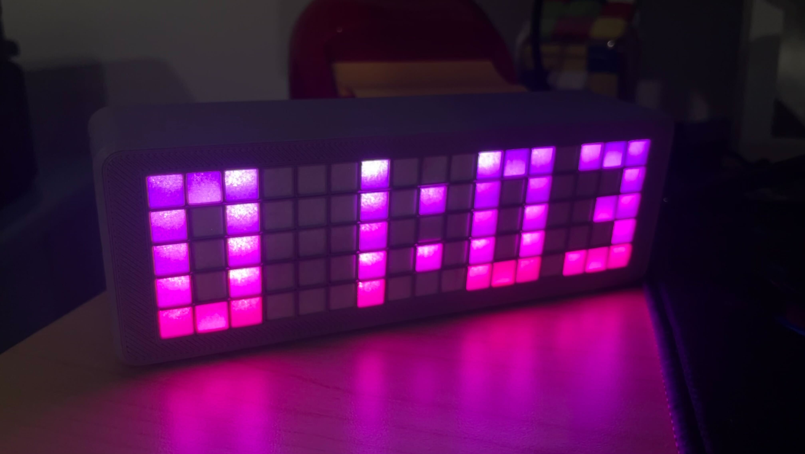

# ESP32_lazy_grid_clock
My version of lazy grid clock

All credits to https://www.instructables.com/Lazy-Mini-Grid/

This works on a ESP32
- No buttons
- connects once on boot to sync time from NTC and disconnects
